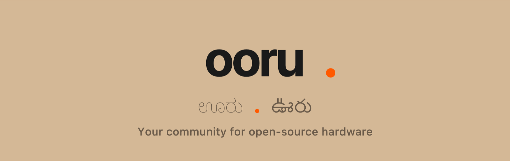

<div align="center">



**A warm community of makers who believe collabration beats competition.**

[ooru.build](https://ooru.build) · [Discord](https://discord.gg/DUSUtguG2H)

</div>

---

**Ooru** (ಊರು in Kannada, ఊరు in Telugu) means *village* or *hometown*. It's a digital community where makers, tinkerers, engineers, artists, and the endlessly curious come together to build hardware and software in the open.

People build real things and share exactly how they're made - so you can fund them, fix them, and make them your own. Every project ships with full source files: bill of materials, schematics, firmware, and CAD.

## What's inside

- **Campaigns** - back open-source hardware that ships with everything you need to study, repair, and rebuild it.
- **Makers** - profiles of the people building what the community needs.
- **Requests** - describe something that should exist; the community refines the spec and a maker brings it to life.
- **Events** - Bengaluru-first STEAM meetups, workshops, hackathons, and talks.

## Tech stack

- **[Astro](https://astro.build) 6** - static-first, with per-page SSR opt-in
- **[Vue 3](https://vuejs.org)** - interactive islands via `@astrojs/vue` (Composition API, `<script setup>`)
- **[Tailwind CSS](https://tailwindcss.com) 3** - utility classes, single config in `tailwind.config.mjs`
- **[Cloudflare Pages](https://pages.cloudflare.com)** - hosting via `@astrojs/cloudflare`
- **pnpm** - package manager

## Quick start

Requires Node `>=22.12.0` and [pnpm](https://pnpm.io).

```bash
pnpm install     # install dependencies
pnpm dev         # start the dev server (localhost:4321)
pnpm build       # build for production
pnpm check       # TypeScript / Astro checking
```

## Project structure

```
src/
├── layouts/BaseLayout.astro    ← Every page wraps in this (head, fonts, nav, footer)
├── components/                 ← Astro (static) and Vue (interactive) components
├── pages/                      ← File-based routing, [slug].astro for dynamic routes
├── data/                       ← Typed mock data arrays (future D1 API drop-in)
├── styles/global.css           ← Shared CSS (cards, buttons, tags, nav, animations)
└── types/index.ts              ← All TypeScript interfaces
```

All content currently lives in `src/data/*.ts` as typed arrays, shaped like what a future
Cloudflare D1 API will return. When the API lands, the import swaps for a fetch call and the
types stay the same.

## Design system

A craft / kraft-paper aesthetic with organic, paper-cut card edges (SVG `feTurbulence` filters).

| Token | Hex | Use |
|-------|-----|-----|
| `kraft` | `#D4B896` | Background, paper texture |
| `paper` | `#FAF3E8` | Card backgrounds |
| `ink` | `#1A1A1A` | Primary text |
| `stamp` | `#FF5900` | Accent, CTAs |
| `funded` | `#2A5F41` | Success / funded state |
| `stencil` | `#6B5B4A` | Secondary text |

**Fonts:** Fraunces (serif headings) + DM Sans (sans body).
**Icons:** Phosphor Icons + FontAwesome brands.
**Logo:** the wordmark is paired with the actual Kannada (ಊರు) and Telugu (ఊరు) script, rendered as vector paths so it's font-independent everywhere.

## Deployment

Cloudflare Pages via the `@astrojs/cloudflare` adapter. All pages prerender (static) by default;
pages that need server-side rendering add `export const prerender = false` in their frontmatter.

## Contributing

Ooru is open-source and built in the open. Come hang out, get build help, and share what
you're making in the [Discord](https://discord.gg/DUSUtguG2H). Issues and pull requests welcome.

## Community

- 🌐 [ooru.build](https://ooru.build)
- 💬 [Discord](https://discord.gg/DUSUtguG2H)
- 📸 [Instagram](https://www.instagram.com/absurd.science)
- ▶️ [YouTube](https://www.youtube.com/@absurd.industries)
- 💼 [LinkedIn](https://in.linkedin.com/company/absurd-explorations)

## License

Copyleft. Released under the [GNU GPL v3](./LICENSE) - study it, repair it, rebuild it, share it.

Built with curiosity in Bengaluru, India. 🛠️
